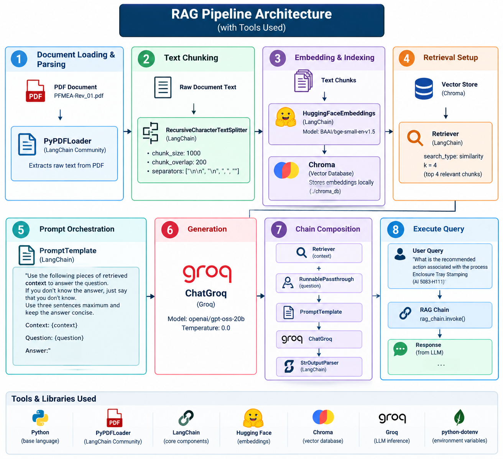

# Production-Grade RAG Systems: Version 0.0 (The Foundation)

Welcome to Version 0.0 of the Production-Grade RAG series. This repository establishes the baseline architecture for a Retrieval-Augmented Generation (RAG) pipeline designed for automotive manufacturing documents (PFMEAs and Control Plans).

Version 0.0 implements a **Naive RAG** approach. The primary goal of this version is to stand up the core infrastructure—getting documents loaded, vectorized, stored, and queried—using an entirely free, open-source stack. By starting with naive parsing, this version explicitly demonstrates the critical data-loss issues that occur when complex engineering tables are processed with basic text splitters.

---

## Architecture Diagram


*(Note: Replace the path above with the link to your generated architecture diagram)*

The Version 0.0 pipeline follows a linear, single-pass ingestion and retrieval flow:

1. **Document Loading:** Ingests raw PDFs via standard text extraction.
2. **Text Chunking:** Slices text at fixed character intervals.
3. **Embedding:** Translates chunks into 384-dimensional mathematical vectors.
4. **Vector Storage:** Indexes the vectors and text payloads in a local database.
5. **Prompt Orchestration:** Injects retrieved context and the user query into a static template.
6. **Generation:** Streams the prompt payload to a cloud LLM for inference.

---

## Tech Stack & Tools Used

This version prioritizes speed, zero-cost tooling, and local data privacy for the embeddings.

- **Orchestration Framework:** `LangChain` (v0.2+)[cite: 2]
- **Document Parsing:** `PyPDFLoader` (Extracts raw, unformatted text coordinates)[cite: 2]
- **Chunking Strategy:** `RecursiveCharacterTextSplitter` (Blind character counting)[cite: 2]
- **Embedding Model:** `HuggingFaceEmbeddings` (`BAAI/bge-small-en-v1.5`) - Runs 100% locally on CPU to protect proprietary engineering data[cite: 2].
- **Vector Database:** `Chroma DB` - Runs locally, storing embeddings in a persistent directory without requiring cloud infrastructure[cite: 2].
- **LLM Inference:** `Groq` (`openai/gpt-oss-20b`) - Delivers lightning-fast, free cloud inference via custom LPU chips[cite: 2].

---

## Setup Instructions

Follow these steps to configure your local environment and run the Version 0.0 pipeline.

1. **Create the Virtual Environment:** Open your terminal at the project root and create a dedicated virtual environment named `rag-pipeline-venv`.
   ```bash
   python -m venv rag-pipeline-venv